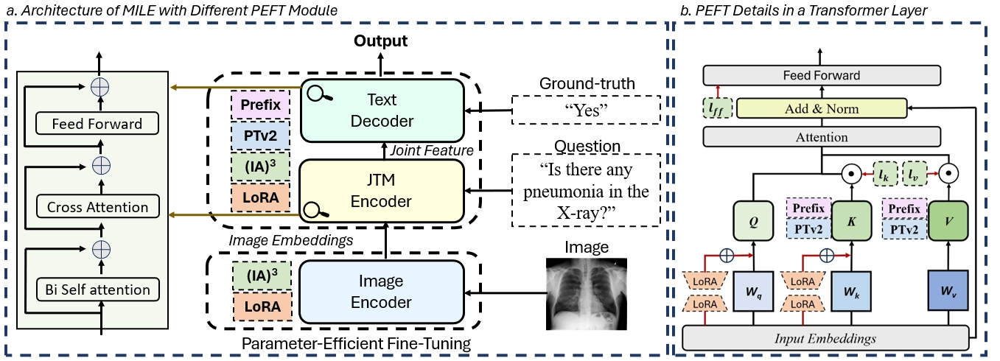

# [MICCAI 2024] Can LLMs' Tuning Methods Work in Medical Multimodal Domain?

## Abstract
While Large Language Models (LLMs) excel in world knowledge understanding, adapting them to specific subfields requires precise adjustments. Due to the model's vast scale, traditional global fine-tuning methods for large models can be computationally expensive and impact generalization. To address this challenge, a range of innovative Parameters-Efficient Fine-Tuning (PEFT) methods have emerged and achieved remarkable success in both LLMs and Large Vision-Language Models (LVLMs). In the medical domain, fine-tuning a medical Vision-Language Pretrained (VLP) model is essential for adapting it to specific tasks. Can the fine-tuning methods for large models be transferred to the medical field to enhance transfer learning efficiency? In this paper, we delve into the fine-tuning methods of LLMs and conduct extensive experiments to investigate the impact of fine-tuning methods for large models on existing multimodal models in the medical domain from the training data level and the model structure level. We show the different impacts of fine-tuning methods for large models on medical VLMs and develop the most efficient ways to fine-tune medical VLP models. We hope this research can guide medical domain researchers in optimizing VLMs' training costs, fostering the broader application of VLMs in healthcare fields.



This is the PyTorch code of the <a href="https://arxiv.org/abs/2403.06407"> paper</a>. To install the dependencies, run: <pre/> pip install -r requirements.txt</pre> 


## Pre-trained checkpoints:
We used the checkpoint provided by [MISS](https://github.com/TIMMY-CHAN/MISS) for MILE fine-tuning.

## Datasets:
1. Downloading links of some medical datasets:

| Dataset Name | Link |
|--------------|------|
| VQA-RAD | https://osf.io/89kps/|
| SLAKE | https://www.med-vqa.com/slake/ |
| RSNA| https://www.rsna.org/education/ai-resources-and-training/ai-image-challenge/rsna-pneumonia-detection-challenge-2018|
| PMC-VQA | https://huggingface.co/datasets/xmcmic/PMC-VQA |


2. The instruction-format dataset proposed in this paper is constructed based on SLAKE and VQA-RAD and stored in [instruction_data.json](https://github.com/TIMMY-CHAN/MILE/blob/main/Instruction_dataset/instruction_data.json). Please prepare the SLAKE and VQA-RAD image datasets, and you can follow the directory setting below:

```
MILE/
├── Instruction_dataset/
│   ├── image/
│   │   ├── slake/
│   │   └── vqa-rad/
│   └── instruction_data.json/
└── ...
```

## Train:
1. This code is based on the SLAKE dataset for demonstration. Prepare your training dataset. Follow [vqa_dataset.py](https://github.com/TIMMY-CHAN/MILE/blob/main/data/vqa_dataset.py) and add a loader for your dataset.

2. [train_MILE.py](https://github.com/TIMMY-CHAN/MILE/blob/main/train_MILE.py) is used for MILE training. Four PEFT methods are provided in this file: LoRA, IA3, Prefix, and P-Tuning (v2). You can add more PEFT methods based on this file. 
3. Modify the paths of your input, output, pre-trained checkpoint, and training config in [train_MILE.py](https://github.com/TIMMY-CHAN/MILE/blob/main/train_MILE.py) and [vqa.yaml](https://github.com/TIMMY-CHAN/MILE/blob/main/configs/vqa.yaml) according to your needs.
4. To fine-tune the baseline model MISS by method MILE, run:
<pre/> python train_MILE.py --lora_MILE False --ia3_MILE False --prefix_MILE False --PTv2_MILE False</pre>

Set the parameter to **True** corresponding to one PEFT method you need to use . Or, it is full parameter fine-tuning if the corresponding parameters of all PEFT methods are **False**.

## Evaluation:
[eval_vqa.py](https://github.com/TIMMY-CHAN/MILE/blob/main/eval_vqa.py) is used for evaluation. 
1. Modify some file paths based on your needs. 
2. Depending on the new PEFT method you use, create a new MILE_model file for evaluation, refering to [mile_lora_eval.py](https://github.com/TIMMY-CHAN/MILE/blob/main/models/mile_lora_eval.py)
3. For evaluation, run:
<pre/> python eval_vqa.py --lora_MILE False --ia3_MILE False --prefix_MILE False --PTv2_MILE False</pre>


## Citation
If you find this code to be useful for your research, please consider citing.
<pre>
@misc{chen2024llms,
      title={Can LLMs' Tuning Methods Work in Medical Multimodal Domain?}, 
      author={Jiawei Chen and Yue Jiang and Dingkang Yang and Mingcheng Li and Jinjie Wei and Ziyun Qian and Lihua Zhang},
      year={2024},
      booktitle={MICCAI}
}
</pre>


## Related Projects

- [MISS](https://github.com/TIMMY-CHAN/MISS)
- [BLIP](https://github.com/salesforce/BLIP)
- [SLAKE](https://www.med-vqa.com/slake/)
- [VQA-RAD](https://osf.io/89kps/)